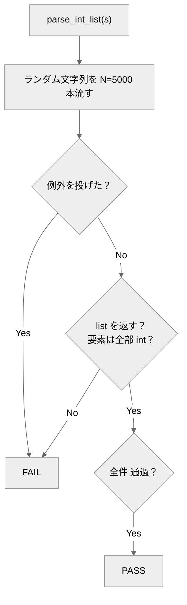

# fuzz-robust-parser-agent

任意の文字列から**カンマ区切りの整数**を取り出す `parse_int_list(s)` を実装するエージェントと、**「どんな入力でも壊れない」ことをランダム入力の大量投入で確かめる**オラクル（採点プログラム）。

## 概要

「正しい出力」を1つ1つ書き出せない処理（任意入力のパーサ）でも、
**当たり前に守るべき約束** ＝ (1) 例外で落ちない (2) 必ず list を返す (3) 要素は int、なら機械的に測れます。
このリポジトリは、その約束を**大量のランダム入力**で突く **ファジング（暗黙オラクル）** の実例です。

## クイックスタート

必要なもの：Python 3 のみ。**リポジトリのルートで実行**。

```bash
python eval/oracle.py            # 正しい堅牢パーサ(reference)を採点 → PASS
python eval/oracle.py --selftest # オラクル自身を検証（②でFAILが出るのが正常）
```

→ ①は採点表に `PASS`、②は最後に `## オラクル判定: PASS`。どちらも終了コード 0（②で壊れた実装に FAIL が出るのは正常）。

## エージェントの動かし方

`.claude/agents/fuzz-robust-parser-agent.md` の指示で `candidate.py` に `parse_int_list(s)` を実装し、`python eval/oracle.py --candidate candidate` で採点。candidate が無くても `reference` で全工程を再現できます。

## しくみ



## 合否（eval）
固定種でランダム文字列を多数流し、(1) 無例外 (2) 返り値は list (3) 要素は int をすべて維持。1件でも破れたら FAIL。

## ファイル構成
- `.claude/agents/…md` … エージェント定義／`eval/oracle.py` … ファジングオラクル（`--selftest` 内蔵）
- `eval/corpus/reference.py` … 正例／`broken_*.py` … 既知バグ（陰性対照）
- `design/design.md` … 設計の考え方

---
自作 AI エージェント集（評価駆動開発の実証）の一つ。背景は [design/design.md](design/design.md)。
